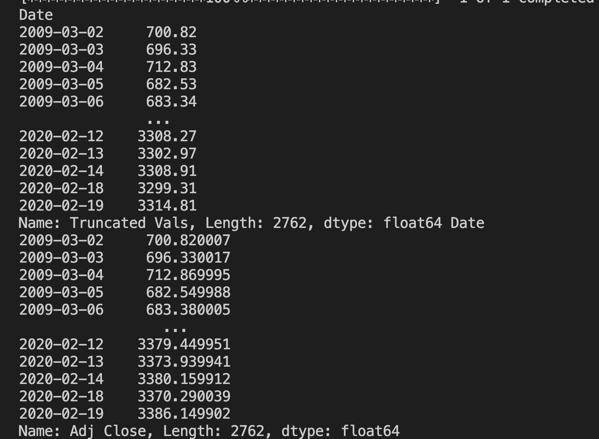

# Stock Market Roundoff Errors Analysis
During a lecture on scientific computation, it was mentioned how round-off errors can drastically impact the final answer. In 1982 round-off errors caused a decline in the Vancouver Stock Exchange. The index was set to 1,000 points initially and was updated after each transaction. Over 22 months the index fell to 520 during a bull market. This was due to rounding errors where the final value was truncated to only two decimal places (ie 599.245 rounds to 599.24). When this was fixed the index was 1098.892. 

The following is the impact of rounding errors on the 2009-2020 bull market run using the S&P 500 index. Python and its various libraries were used to test out the impact of rounding errors. Past data was acquired using the “yfinance” open-source library to access the financial data available on Yahoo Finance. The estimated beginning of the bull market was noted to be on March 9, 2009, and the end was around February 2020 during the COVID-19 pandemic. Pandas, an open-source Python library, ​​was used for data manipulation and Matplotlib was used to create static visualizations of the index performance as well as the relative error.

## Results: 

